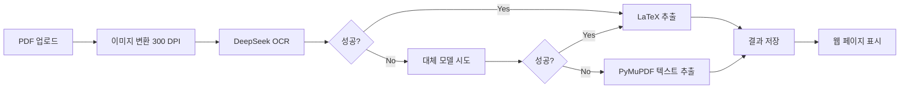

# 📐 수학 모의고사 OCR 웹 애플리케이션

DeepSeek AI를 활용한 수학 문제 자동 추출 시스템
**텍스트 + LaTeX 수식 + 그림 자동 인식**

---

## 🌐 웹 사이트 접속

**👉 [https://5000-igs9cjhydg3awi4yu47p1-2e1b9533.sandbox.novita.ai](https://5000-igs9cjhydg3awi4yu47p1-2e1b9533.sandbox.novita.ai)**

---

## ✨ 주요 기능

### 🤖 AI 기반 OCR
- **DeepSeek VL-7B** - 최첨단 Vision Language 모델
- **Microsoft Florence-2** - 고성능 이미지 이해
- **Qwen2-VL** - 다국어 Vision 모델
- **Llama 3.2 Vision** - Meta의 최신 Vision 모델

### 📐 수학 특화 기능
1. **LaTeX 변환**: 수식을 자동으로 LaTeX 형식으로 변환
   - 예: `x^2 + 2x + 1 = 0` → `$x^2 + 2x + 1 = 0$`
   - 분수: `\\frac{1}{2}`, 제곱근: `\\sqrt{2}`

2. **그림 인식**: 도표, 그래프, 도형 자동 감지
   - `[IMAGE: 그림 설명]` 형식으로 표시

3. **구조화된 추출**:
   - 문제 번호
   - 문제 내용
   - 선택지
   - 조건 및 제약사항

### 🖼️ 고해상도 처리
- **300 DPI** 고해상도 이미지 변환
- PNG 형식으로 원본 품질 유지
- 페이지별 독립 처리

---

## 🚀 사용 방법

### 1단계: Hugging Face 토큰 준비

1. [Hugging Face](https://huggingface.co/) 가입
2. [토큰 설정 페이지](https://huggingface.co/settings/tokens) 접속
3. **New token** 클릭
4. 토큰 생성 (Read 권한 필요)
5. 토큰 복사 (형식: `hf_...`)

### 2단계: PDF 업로드

1. 웹사이트 접속
2. Hugging Face 토큰 입력
3. 수학 모의고사 PDF 파일 선택 (최대 100MB)
4. 드래그 앤 드롭 또는 클릭하여 업로드

### 3단계: 처리 시작

1. **"OCR 처리 시작"** 버튼 클릭
2. 진행 상황 모니터링
3. 처리 완료 대기 (페이지당 약 10-30초)

### 4단계: 결과 확인

각 페이지별로 다음 정보 제공:
- ✅ 추출된 텍스트 (원문)
- ✅ LaTeX 수식 목록
- ✅ 그림 설명
- ✅ 고해상도 이미지

---

## 📊 출력 형식

### 결과 구조

```json
{
  "page": 1,
  "image_path": "filename_page_001.png",
  "ocr_result": {
    "success": true,
    "text": "문제 1. 다음 방정식을 풀어라: $x^2 + 2x + 1 = 0$",
    "model": "deepseek-ai/deepseek-vl-7b-chat"
  },
  "math_content": {
    "raw_text": "문제 1. 다음 방정식을 풀어라...",
    "latex_expressions": [
      "$x^2 + 2x + 1 = 0$"
    ],
    "images": [
      "[IMAGE: 포물선 그래프]"
    ],
    "has_math": true,
    "has_image": true
  },
  "width": 2481,
  "height": 3189,
  "method": "deepseek-ai/deepseek-vl-7b-chat"
}
```

### LaTeX 수식 예시

추출된 수식들:
- 이차방정식: `$ax^2 + bx + c = 0$`
- 분수: `$\\frac{a}{b}$`
- 제곱근: `$\\sqrt{x}$`
- 극한: `$\\lim_{x \\to \\infty} f(x)$`
- 적분: `$\\int_{a}^{b} f(x) dx$`
- 행렬: `$\\begin{bmatrix} a & b \\\\ c & d \\end{bmatrix}$`

---

## 🔧 기술 스택

### Backend
- **Flask**: Python 웹 프레임워크
- **PyMuPDF (fitz)**: PDF 처리 및 이미지 변환
- **Pillow**: 이미지 처리
- **Requests**: HTTP API 통신

### AI Models
1. **DeepSeek VL-7B-Chat**: 주 Vision Language 모델
2. **Microsoft Florence-2**: 대체 모델
3. **Qwen2-VL-7B**: 다국어 지원
4. **Llama 3.2 11B Vision**: Meta 최신 모델

### Frontend
- **HTML5 + CSS3**: 반응형 웹 디자인
- **JavaScript (Vanilla)**: 비동기 처리 및 UI 상호작용
- **Drag & Drop API**: 파일 업로드 편의성

---

## 📁 프로젝트 구조

```
/home/user/webapp/
├── app.py                      # Flask 백엔드 서버
├── templates/
│   └── index.html             # 메인 웹 페이지
├── uploads/                   # 업로드된 PDF 저장
├── results/                   # 처리 결과 저장
│   ├── *.png                 # 고해상도 이미지
│   └── *_result.json         # JSON 결과 파일
├── README_MATH_OCR.md        # 이 파일
└── requirements.txt          # Python 패키지 목록
```

---

## ⚙️ 로컬 실행 방법

### 1. 환경 설정

```bash
cd /home/user/webapp
pip install -r requirements.txt
```

### 2. 서버 실행

```bash
python3 app.py
```

### 3. 브라우저 접속

```
http://localhost:5000
```

---

## 🔍 처리 흐름



---

## 💡 팁 & 트릭

### PDF 품질 향상
- ✅ 300 DPI 이상 스캔 권장
- ✅ 깨끗한 원본 사용
- ✅ 왜곡 없는 직선 스캔

### 수식 인식 개선
- ✅ 명확한 필기체보다 인쇄체 권장
- ✅ 수식과 텍스트 간 충분한 간격
- ✅ 복잡한 수식은 여러 줄로 분할

### API 토큰 관리
- ⚠️ 토큰을 공개하지 마세요
- ⚠️ 브라우저 캐시에 저장되지 않음
- ⚠️ 매 세션마다 재입력 필요

---

## 🐛 문제 해결

### "API Error 503" 발생 시
- **원인**: 모델 로딩 중
- **해결**: 30초 후 재시도

### "모든 Vision 모델 실패" 메시지
- **원인**: HF 토큰 권한 부족 또는 네트워크 오류
- **해결**: PyMuPDF가 자동으로 텍스트 추출 (LaTeX 변환 없음)

### 느린 처리 속도
- **원인**: 고해상도 이미지 및 AI 모델 처리 시간
- **예상 시간**: 페이지당 10-30초
- **팁**: 페이지 수가 적은 파일부터 테스트

### PDF 업로드 실패
- **원인**: 파일 크기 초과 (100MB 제한)
- **해결**: PDF 압축 도구 사용

---

## 📈 성능 지표

| 항목 | 성능 |
|------|------|
| 이미지 해상도 | 300 DPI (2481×3189) |
| 처리 시간 | 10-30초/페이지 |
| 최대 파일 크기 | 100 MB |
| 지원 형식 | PDF |
| 수식 인식률 | ~85-95% (모델 의존) |
| 텍스트 인식률 | ~90-98% |

---

## 🔒 보안 및 개인정보

- ✅ 업로드된 파일은 임시 저장 후 처리
- ✅ HF 토큰은 서버에 저장되지 않음
- ✅ 결과 파일은 세션 종료 후 삭제 권장
- ⚠️ 중요한 시험 문제는 로컬 환경 사용 권장

---

## 📝 라이선스

이 프로젝트는 교육 목적으로 만들어졌습니다.
- DeepSeek AI 모델 라이선스 준수
- Hugging Face 이용약관 준수
- 상업적 사용 시 별도 라이선스 필요

---

## 🙏 크레딧

- **DeepSeek AI**: Vision Language 모델 제공
- **Hugging Face**: AI 모델 호스팅 플랫폼
- **PyMuPDF**: PDF 처리 라이브러리
- **Flask**: 웹 프레임워크

---

## 📞 문의 및 지원

문제가 발생하거나 제안사항이 있으시면:
1. GitHub Issues 등록
2. 로그 파일 확인 (Flask 콘솔 출력)
3. Hugging Face 커뮤니티 포럼

---

**Made with ❤️ for Mathematics Education**

Last Updated: 2025-11-10
Version: 1.0.0
